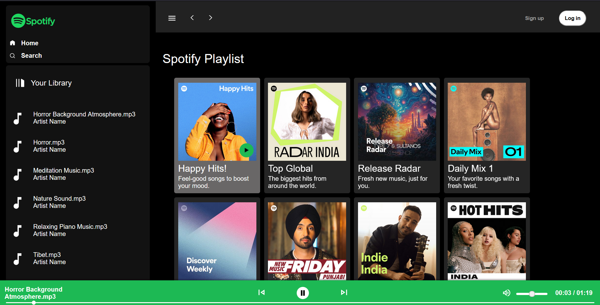

# 🎵 Spotify-Style Web Music Player

A responsive, web-based music player that mimics the look and feel of Spotify. This project demonstrates core front-end development skills including dynamic UI rendering, audio playback control using the Web Audio API, and asynchronous data handling for playlists.

---

## 📌 Features

- 🎧 **Spotify-like User Interface**  
  Clean and intuitive layout inspired by the Spotify web player.

- 📂 **Dynamic Playlist Management**  
  Add, remove, and update playlists in real-time.

- ⏯ **Full Playback Controls**  
  Includes play, pause, next, and previous buttons for seamless music experience.

- 🔊 **Volume Normalization**  
  Ensures consistent volume levels across all tracks using the Audio API.

- 🔄 **Asynchronous Playlist Loading**  
  Simulates real-world streaming by dynamically loading playlist data.

- 📱 **Responsive Design**  
  Mobile-friendly and adapts well to different screen sizes.

---

## 🛠️ Tech Stack

- **HTML5 / CSS3 / JavaScript (ES6+)**
- **Web Audio API** for sound control
- **Fetch API** for asynchronous data
- *(Optional: React / Vue / Tailwind if used)*

---

## 📸 Screenshots

 

  

---

💡 Learning Highlights

This project helped me strengthen my knowledge of:

    DOM manipulation and modern JavaScript

    Browser-native Audio handling

    Creating responsive UI with Flexbox and Grid

    Working with asynchronous data

    Building user-focused web apps

📈 Future Enhancements

    🎙️ Lyrics integration

    💚 Like/favorite song system

    🧠 Smart shuffle / repeat features

    🎵 Integration with Spotify Web API

    🔐 User authentication for saved playlists

🙋‍♂️ About Me

I'm a passionate web developer aiming to build impactful, scalable, and user-centric applications. This project reflects my interest in music tech and hands-on UI/UX design.

Feel free to connect on LinkedIn or check out more of my work!
